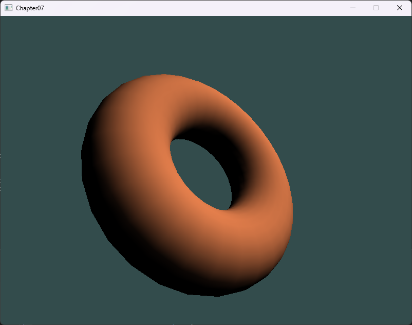

# Chapter07 Phong 模型的漫反射

[返回](../../README.md)

本章将介绍 Phong 模型的漫反射部分，而且光照效果在**顶点着色器**中完成。

## 7.1 漫反射简介

漫反射是指光线照射到粗糙表面后向各个方向均匀反射的现象。漫反射的强度与入射光线与表面法线之间的夹角有关。

核心规律是:

- 表面某点的漫反射强度只取决于光线方向和表面法线方向的夹角；

- 光线越 **正对着** 表面照射（越接近垂直入射），该点越亮；

- 光线越贴着表面掠过（越接近切向），该点越暗；

Phong 的漫反射项通常包含三部分相乘:

1. 入射角因子，用法线方向 N 与光照方向 L 的点积表示，当 N·L 为正时，漫反射强度随 N·L 线性变化；当为负时取 0。
2. 材质的漫反射反射率（Kd），表示材质本身 **接受并反射多少颜色/能量**，可以是标量也可以是 RGB 颜色。
3. 光源的漫反射强度/颜色（Ld 或 light color/intensity），表示光本身的颜色与亮度，决定被照亮区域的整体色调与强度。

**注:** Phong 漫反射 = 光的颜色强度 × 材质的漫反射颜色（或反射率） × max(0, N·L)


## 7.2 漫反射的 GLSL 实现

phong_diffuse.vs.glsl
``` GLSL
#version 460

layout (location = 0) in vec3 vertex_position;
layout (location = 1) in vec3 vertex_normal;

layout (location = 0) out vec3 light_intensity;

uniform vec4 u_light_position_in_view;
uniform vec3 u_Kd;
uniform vec3 u_Ld;

uniform mat4 u_view_model_matrix;
uniform mat3 u_normal_matrix;
uniform mat4 u_mvp_matrix;

void main()
{
    vec3 normal = normalize(u_normal_matrix * vertex_normal);
    vec4 position_in_view = u_view_model_matrix * vec4(vertex_position, 1.0);
    vec3 s = normalize(vec3(u_light_position_in_view - position_in_view));
    light_intensity = u_Ld * u_Kd * max(dot(s, normal), 0.0);
    gl_Position = u_mvp_matrix * vec4(vertex_position, 1.0);
}
```

phong_diffuse.fs.glsl
``` GLSL
#version 460

layout (location = 0) in vec3 light_intensity;

layout (location = 0) out vec4 fragment_color;

void main()
{
    fragment_color = vec4(light_intensity, 1.0);
}
```

## 7.3 漫反射效果展示



[返回](../../README.md)