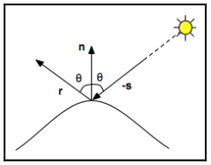
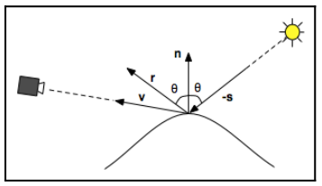

# Chapter08 完整的 Phong 模型

[返回](../../README.md)

本章将介绍 Phong 模型的完整模型，而且光照效果在**顶点着色器**中完成。其中漫反射部分在 [Chapter07](../chapter07/Chapter07.md) 中介绍。

## 8.1 Phong 模型简介

Phong 模型分为三个部分: 环境光反射、漫反射和镜面反射。

- 环境光反射用于模拟已经被多次反射的光，看起来像是从各个方向均匀发散的光。
- 漫反射用于模拟全方向散射的光。
- 镜面反射用于模拟高光。

### 8.1.1 环境光反射

- 环境光反射表示均匀照亮所有表面的光，并在所有方向上均匀反射，它用于帮助照亮场景中的一些较暗区域。
- 环境光反射不依赖与入射光和出射光的方向。
- 简单的用光源强度(**La**)和表面反射率(**Ka**)的点成表示结果: **Ia** = **La** · **Ka**。

### 8.1.2 镜面反射

- 高光分量用于模拟表面的光泽。
- 对于完美反射，入射角等于反射角，并且矢量与表面法线共面，如下图所示:



反射光的方向 **r** 的计算公式: **r** = -**s** + 2(**s** · **n**)**n**

为了计算镜面反射，需要获取以下参数:
- 指向光源的方向(**s**)
- 完美反射向量(**r**)
- 指向相机的方向(**v**)
- 表面法向量(**n**)



当指向相机的方向 **v** 与完美反射向量 **r** 一致时，反射达到最大值；
当指向相机的方向 **v** 与完美反射向量 **r** 不一致时，反射强度迅速减弱，这可以通过 **v** 与 **r** 之间的夹角的余弦值的幂(f)表示:

**Is** = **Ls** · **Ks** · (**r** · **v**)^f

### 8.1.3 Phong 完整模型的公式

**I** = **Ia** + **Id** + **Is** = **La** · **Ka** + **Ld** · **Kd** · max(0, **n**·**s**) + **Ls** · **Ks** · (**r** · **v**)^f

## 8.2 着色器代码

phong.vs.glsl
``` GLSL
#version 460

layout (location = 0) in vec3 vertex_position;
layout (location = 1) in vec3 vertex_normal;

layout (location = 0) out vec3 light_intensity;

uniform struct LightInfo
{
    vec4 position_in_view;
    vec3 La;
    vec3 Ld;
    vec3 Ls;
} u_light;

uniform struct MaterialInfo
{
    vec3 Ka;
    vec3 Kd;
    vec3 Ks;
    float shininess;
} u_material;

uniform mat4 u_view_model_matrix;
uniform mat3 u_normal_matrix;
uniform mat4 u_mvp_matrix;

void main()
{
    vec3 normal = normalize(u_normal_matrix * vertex_normal);
    vec4 position_in_view = u_view_model_matrix * vec4(vertex_position, 1.0);
    vec3 s = normalize(vec3(u_light.position_in_view - position_in_view));

    vec3 ambient_color = u_light.La * u_material.Ka;

    vec3 diffuse_color = u_light.Ld * u_material.Kd * max(dot(normal, s), 0.0);

    vec3 v = normalize(-position_in_view.xyz);
    vec3 r = reflect(-s, normal);
    vec3 specular_color = u_light.Ls * u_material.Ks * pow(max(dot(r, v), 0.0), u_material.shininess);

    light_intensity = ambient_color + diffuse_color + specular_color;

    gl_Position = u_mvp_matrix * vec4(vertex_position, 1.0);
}
```

phong.fs.glsl
``` GLSL
#version 460

layout (location = 0) in vec3 light_intensity;

layout (location = 0) out vec4 fragment_color;

void main()
{
    fragment_color = vec4(light_intensity, 1.0);
}
```

[返回](../../README.md)