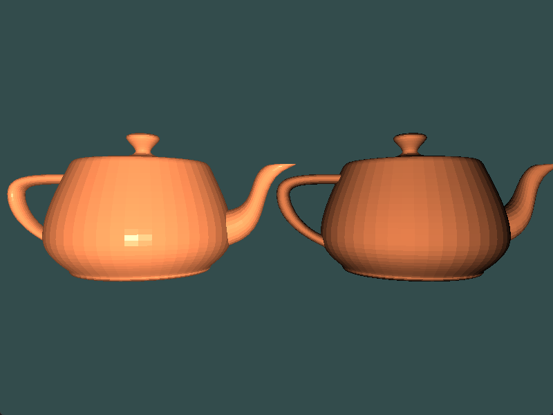

# Chapter12 使用子程序选择着色器功能

[返回](../../README.md)

**子程序**是 GLSL 中的一种机制，根据变量的值将函数调用绑定到一组函数中的一个。
用一个 **uniform** 变量充当指针，用于调用函数。
这个 **uniform** 变量的值可以在 OpenGL 程序中设置。

子程序函数的定义要求:
- **不需要**有相同的名称。
- **必须**有相同**数量**和**类型**的参数。
- **必须**有相同的返回值**类型**。

**子程序**提供了一种在运行时选择替代实现的方法，无需交换着色器程序和/或重新编译，或使用与统一变量结合的 if 语句。
例如，可以编写一个单独的着色器来提供几种着色算法，供场景中不同的对象使用。
在渲染场景时，无需交换着色器程序或使用条件语句，只需更改子程序的统一变量，就可以在渲染每个对象时选择适当的着色算法。

使用子程序，可以在不增加计算开销的情况下实现条件语句或着色器切换的功能。

**注:** SPIR-V 不支持子程序。SPIR-V 是 OpenGL 中着色器的未来，所以子程序应被视为弃用。

## 12.1 创建子程序

### 12.1.1 添加子程序类型

``` GLSL
subroutine vec3 ShadeModelType(vec3 position, vec3 normal);
```

### 12.1.2 添加子程序 uniform 变量

``` GLSL
subroutine uniform ShadeModelType shade_model;
```

### 12.1.3 添加两个子程序

subroutines.vs.glsl
``` GLSL
subroutine(ShadeModelType)
vec3 CalculatePhongModel(vec3 position, vec3 normal)
{
  vec3 ambient_color = u_light.La * u_material.Ka;

  vec3 s = normalize(u_light.position_in_view.xyz - position);
  float s_dot_n = max(dot(s, normal), 0.0);
  vec3 diffuse_color = u_light.Ld * u_material.Kd * s_dot_n;

  vec3 specular_color = vec3(0.0);
  if(s_dot_n > 0.0)
  {
    vec3 v = normalize(-position.xyz);
    vec3 r = reflect(-s, normal);
    specular_color = u_light.Ls * u_material.Ks * pow(max(dot(r, v), 0.0), u_material.shininess);
  }

  return ambient_color + diffuse_color + specular_color;
}

subroutine(ShadeModelType)
vec3 CalculateDiffuseOnly(vec3 position, vec3 normal)
{
    vec3 s = normalize(u_light.position_in_view.xyz - position);
    return u_light.Ld * u_material.Kd * max(dot(s, normal), 0.0);
}
```

### 12.1.4 调用子程序

``` GLSL
light_intensity = shade_model(view_position, view_normal);
```

## 12.2 在 C++ 端设置子程序

可以通过 `glGetSubroutineIndex` 获取 子程序索引，然后通过 `glUniformSubroutinesuiv` 设置子程序。

``` C++
GLuint phong_subroutine_index = program.GetSubroutineIndex(glsl_shader::ShaderType::Vertex, "CalculatePhongModel");
GLuint diffuse_only_subroutine_index = program.GetSubroutineIndex(glsl_shader::ShaderType::Vertex, "CalculateDiffuseOnly");

glm::mat4 view = glm::lookAt(glm::vec3(0.0f, 0.0f, 10.0f), glm::vec3(0.0f, 0.0f, 0.0f), glm::vec3(0.0f, 1.0f, 0.0f));
glm::mat4 projection = glm::perspective(glm::radians(50.0f), 4.0f / 3.0f, 0.3f, 100.0f);
glm::mat4 model = glm::mat4(1.0f);

program.SetSubroutineIndex(glsl_shader::ShaderType::Vertex, 1, &phong_subroutine_index);
model = glm::translate(model, glm::vec3(-3.0, -1.5, 0.0));
model = glm::rotate(model, glm::radians(-90.0f), glm::vec3(1.0f, 0.0f, 0.0f));
glm::mat4 mv = view * model;
program.SetUniform("u_view_model_matrix", mv);
program.SetUniform("u_normal_matrix", glm::mat3(glm::vec3(mv[0]), glm::vec3(mv[1]), glm::vec3(mv[2])));
program.SetUniform("u_mvp_matrix", projection * mv);
teapot->Render();

program.SetSubroutineIndex(glsl_shader::ShaderType::Vertex, 1, &diffuse_only_subroutine_index);
model = glm::mat4(1.0f);
model = glm::translate(model, glm::vec3(3.0f, -1.5f, 0.0f));
model = glm::rotate(model, glm::radians(-90.0f), glm::vec3(1.0f, 0.0f, 0.0f));
mv = view * model;
program.SetUniform("u_view_model_matrix", mv);
program.SetUniform("u_normal_matrix", glm::mat3(glm::vec3(mv[0]), glm::vec3(mv[1]), glm::vec3(mv[2])));
program.SetUniform("u_mvp_matrix", projection * mv);
teapot->Render();
```

这段代码中先利用 `glGetSubroutineIndex` 获取两个子程序的索引，
然后要调用子程序是先调用 `glUniformSubroutinesuiv` 设置激活子程序。
然后设置各 **uniform** 变量的值，之后再渲染。

- 当调用 `glUseProgram` 或其他方法将着色器程序从管线解绑时，子例程绑定会被重置。
所以每次激活着色器程序时都调用 `glUniformSubroutinsuiv`。
- 在着色器中定义的子例程函数可以匹配多种子例程类型。
子例程限定符可以包含以逗号分隔的子例程类型列表。
例如，如果一个子例程匹配类型 type1 和 type2，我们可以使用以下限定符: `subroutine(type1, type2)`。

## 12.3 子程序渲染展示



右侧是 Phong 模型渲染结果，左侧是仅渲染 Diffuse。

[返回](../../README.md)