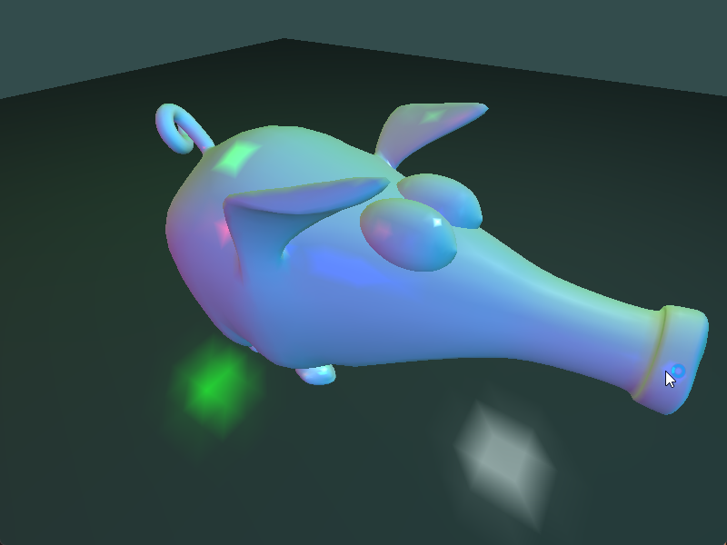

# Chapter14 多光源渲染

[返回](../../README.md)

在使用多个光源进行着色时，需要对每个光源评估反射模型，并将结果相加以确定表面某一点反射的总光强度。
创建 **uniform** 数组来存储每个光源的位置和强度。使用结构体数组，在单个 **uniform** 变量中存储多个光源的值。

## 14.1 创建 uniform 数组

``` GLSL
uniform struct LightInfo
{
    vec4 position_in_view;
    vec3 La;
    vec3 L;
} u_lights[5];
```

先创建 **uniform** 结构体，在最后的变量声明后添加 `[5]` 表明这是一个数组，该数据存储5个变量。

## 14.2 在 C++ 中设置单个光源的属性

``` C++
program.SetUniform("u_lights[0].L", glm::vec3(0.0f, 0.8f, 0.8f));
program.SetUniform("u_lights[0].La", glm::vec3(0.0f, 0.2f, 0.2f));
```

利用 `u_lights[0]` 表示 **uniform** 数组中的第0个元素。

## 14.3 多光源渲染展示



[返回](../../README.md)