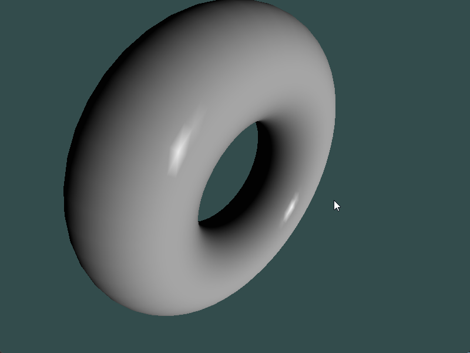

# Chapter15 方向光渲染

[返回](../../README.md)

渲染方程的一个核心组成部分是从表面位置指向光源的向量(**s**)。
对于非常远的光源，向量 **s** 在物体表面上的变化非常小。
实际上，对于非常遥远的光源，这个向量在表面上的所有点基本上是相同的。
这种模型适用于远距离但强大的光源，例如太阳。
这种光源通常被称为方向光源，因为它没有具体的位置，只有方向。

在以前的 OpenGL 版本中，光源位置的第四个分量用于确定光源是否被视为方向光。
第四个分量为 **零** 表示光源是方向光，并且位置将被视为指向光源的方向。
否则，位置将被视为光源的实际位置。

## 15.1 替换 Phong 模型中光线方向的生成

``` GLSL
vec3 s;
if( u_light.position_in_view.w == 0.0 )
{
    s = normalize(u_light.position_in_view.xyz);
}
else
{
    s = normalize(u_light.position_in_view.xyz - position);
}
```

这里根据光源位置的第四个分量判断光源是否为方向光，如果第四个分量为0则是方向光。

## 15.2 方向光渲染展示



[返回](../../README.md)