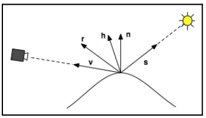

# Chapter17 Blinn-Phong 反照模型

[返回](../../README.md)

在 [Chapter08](../chapter08/Chapter08.md) 中介绍了 Phong 反照模型，Blinn-Phong 反照模型与 Phong 反照模型的区别在于镜面反射分量的计算方式不同。

Blinn-Phong 反照模型中，镜面反射采用了 **半向量** : **h** = **s** + **v**。

镜面反射的结果为: **Is** = **LsKs(h · n)^f**

[返回](../../README.md)