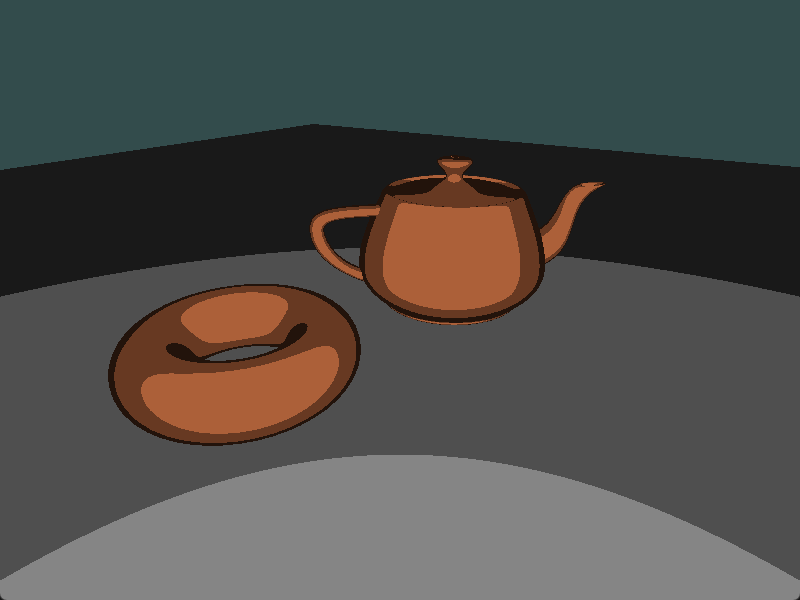

# Chapter19 卡通着色特效

[返回](../../README.md)

卡通渲染（也称为赛璐璐渲染）是一种非真实感渲染技术，旨在模仿手绘动画中常用的阴影风格。
基本效果是拥有大面积的恒定颜色，并且这些区域之间有明显的过渡。

本章节介绍的技术只涉及计算典型ADS着色模型的环境光和漫反射分量，并对漫反射分量的余弦项进行量化。

| cos 值 | 取值 |
| ------ | ---------- |
| 0.75-1.0 | 0.75 |
| 0.5-0.75 | 0.5 |
| 0.25-0.5 | 0.25 |
| 0.0-0.25 | 0.0 |

通过以这种方式限制余弦项的值，阴影会从一个等级到另一个等级显示出强烈的不连续性，模拟手绘动画中的笔画效果。

## 19.1 限制 cos 值

``` GLSL
const int levels = 3;
const float scale_factor = 1.0 / levels;

vec3 ToonShade()
{
    vec3 normal = normalize(normal_in_view);
    vec3 s = normalize(u_light.position_in_view.xyz - position_in_view);

    vec3 ambient_color = u_light.La * u_material.Ka;

    float s_dot_n = max(dot(s, normal), 0.0);
    vec3 diffuse_color = u_material.Kd * floor(s_dot_n * levels) * scale_factor;

    return ambient_color + u_light.L * diffuse_color;
}
```

常量变量 `levels` 定义了在漫反射计算中将使用多少个不同的值。
这也可以定义为一个 uniform 变量，以便从主 OpenGL 应用程序进行配置。
使用这个变量来量化漫反射计算中余弦项的值。

`ToonShade` 函数是这个着色器中最重要的部分。
首先计算 **s**，指向光源的向量。
接下来，通过计算 **s** 和 **normal** 的点积来求漫反射分量的余弦项。
由于这向量 **s** 和 向量 **normal** 已被归一化，并且使用 max 函数去除了负值，所以可以确保余弦值在零到一之间。
通过将该值乘以 `levels` 并取整，结果将是 0 到 `levels - 1` 之间的一个整数。
将该值乘以 `scale_factor` 时，会将这些整数值重新缩放到 0 到 1 之间。
结果是一个在 0 到 1 之间的 `levels` 个可能值之一。该结果随后乘以 `u_material.Kd`，即漫反射反射率项。

最后，将漫反射和环境光分量结合在一起，得到片元的最终颜色。

## 卡通着色特效展示



[返回](../../README.md)