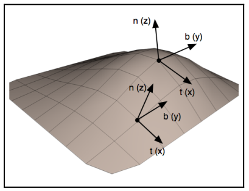

# Chapter25 使用法线贴图

[返回](../../README.md)

法线映射是一种用于“伪造”表面在几何上实际上不存在的变化的技术。
它对于生成具有凸起、凹痕、粗糙或皱纹的表面非常有用，无需真正提供足够的位置信息(顶点)来完全定义这些形变。
底层表面实际上是光滑的，但通过使用法线贴图改变法线向量，使其看起来粗糙。
这项技术与凹凸贴图或位移贴图密切相关。
根据存储在法线贴图中的信息修改法线向量，在不实际提供凸起几何形状的情况下创建出表面起伏的外观。

法线贴图是一种纹理，存储在纹理中的数据被解释为法线向量而不是颜色。
法线向量通常编码在法线贴图的 RGB 信息中，其中红色通道包含 x 坐标，绿色通道包含 y 坐标，蓝色通道包含 z 坐标。
法线贴图可以作为纹理使用，其中纹理值影响反射模型中使用的法线向量，而不是表面的颜色。
这样可以使表面看起来像有起伏(凹凸或皱纹)，即使这些在网格的几何形状中实际上并不存在。

法线贴图被解释为切线空间中的向量。
在切线坐标系统中，原点位于表面点处，且表面的法线与 z 轴(0, 0, 1)对齐。
因此，x 轴和 y 轴位于表面切线方向。

使用切线空间坐标系的优势在于，存储在法线贴图中的法线矢量可以被视为对真实法线的扰动，并且与物体坐标系统无关。
这避免了转换法线、添加扰动法线和重新归一化的需要。
相反，可以在反射模型中直接使用法线贴图中的值，而无需进行任何修改。

为了使这一切工作，我们需要在切线空间中计算反射模型。
为此，我们在顶点着色器中将反射模型中使用的向量转换到切线空间，然后将它们传递给片元着色器，在那里计算反射模型。
要定义从相机坐标系到切线空间坐标系的转换，我们需要三个在眼睛坐标下定义的、归一化且互相正交的向量，这些向量定义了切线空间坐标系。
z 轴由法向量(n)定义，x 轴由一个称为切线向量(t)的向量定义，y 轴通常称为副法线向量(b)。
在相机坐标中定义的点 P 可以通过以下方式转换到切线空间
$$
\begin{bmatrix}
S_x\\
S_y\\
S_z
\end{bmatrix}
=
\begin{bmatrix}
t_x & t_y & t_z\\
b_x & b_y & b_z\\
n_x & n_y & n_z
\end{bmatrix}
\begin{bmatrix}
P_x\\
P_y\\
P_z
\end{bmatrix}
$$

在前面的方程中，S 是切线空间中的点，P 是相机坐标中的点。
为了在顶点着色器中应用这一变换，OpenGL 程序必须至少提供定义物体局部系统的三个向量中的两个，以及顶点位置。
通常的情况是提供法向量(n)和切线向量(t)。
如果提供了切线向量，则副法向量可以通过切线向量和法向量的叉积计算得出。

切线向量有时会作为额外数据包含在网格数据结构中，可以在 [这里](https://terathon.com/blog/tangent-space.html) 找到计算方法。

**注:** 必须注意切向量在整个曲面上定义的一致性。切向量的方向不应在一个顶点与其相邻顶点之间变化过大。否则，可能会导致伪影。

## 25.1 使用法线贴图渲染展示

[返回](../../README.md)