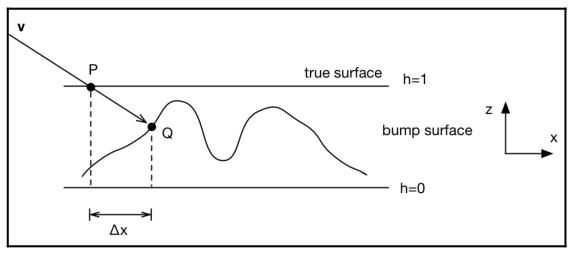
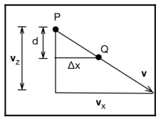
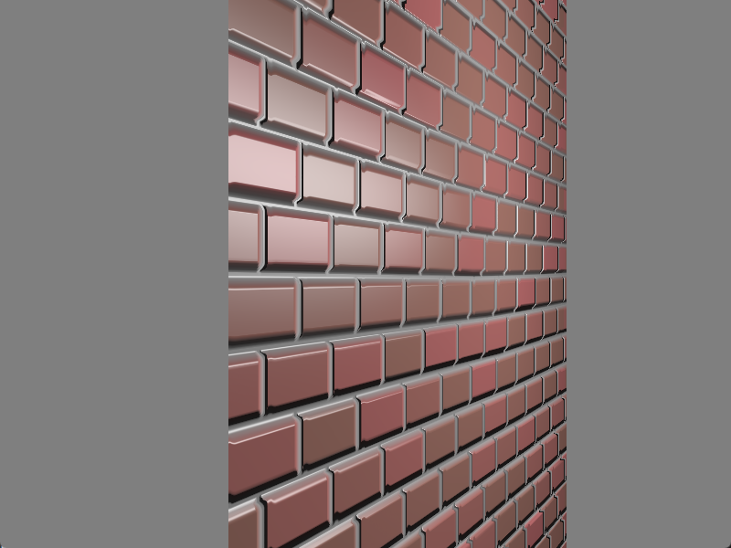

# Chapter26 使用视差贴图

[返回](../../README.md)

法线贴图是引入表面细节而无需增加额外几何体的好方法。
然而，它们也有一些局限性。例如，法线贴图无法随着观察者位置的变化提供视差效果，也不支持自遮挡。
视差贴图是一种通过基于高度图修改纹理坐标来模拟视差和自遮挡效果的技术。
它既需要法线贴图，也需要高度图。
高度图(也称为凹凸贴图)是一种灰度图像，其中每个像素具有一个标量值，表示该像素处表面的高度。
我们可以将高度值在0到1之间的任何数视为真实表面，然后使用高度图中的值作为相对于真实表面的偏移。
在本章节中，使用1.0的值作为真实表面，高度图值为0.0表示距离真实表面1.0的高度。

为了模拟视差，需要根据朝向摄像机的方向来偏移纹理坐标。
视差效果在角度较陡时更强，因此当法线与视向量之间的角度较大时，偏移量更大。
此外，将使用切线空间来处理。

在切线空间中，法线向量与 z 轴相同。
如果 e 是指向摄像机的切线空间向量，使用指向相反方向的向量(v = -e)。
首先，考虑标准法线贴图的情况。
观察者感知到的是点 P 的颜色和法线，但他们应该看到的是点 Q 的颜色和法线：

因此，应该按与前图中 **Δx** 成比例的量来偏移纹理坐标，这样观察者看到的就是点Q的阴影，而不是点P的阴影。
也可以为 **y - z** 截面画一张类似的图，结果几乎相同。

所以，需要以某种方式近似 **Δx**。

**d** 的值是点 **Q** 的深度(低于真实表面)。即，**d = 1 - hq**，其中 **hq** 是点 **Q** 处凹凸贴图的高度。
根据相似三角形的原理，可以写出如下公式:
$$
\frac{\Delta x}{d} = \frac{v_x}{v_z}
$$

对 y 采用相同的分析:
$$
\Delta x = \frac{d v_x}{v_z}
$$

$$
\Delta y = \frac{d v_y}{v_z}
$$

目前，在前面的方程中没有 **d** 的值，因为不知道 Q 的值，也没有快速找到它的方法。
所以目前，只能通过使用 **P** 点的高度(1 - hp)来近似 **d**。
这只是一个近似，但如果假设高度图没有太多高频变化，它在实践中效果还是相当不错的。

因此，对于给定表面点的纹理坐标 (P) 偏移，有以下方程:
$$
P' = P + S(1 - h_p) \left( \frac{v_x}{v_z}, \frac{v_y}{v_z} \right)
$$

其中，**S** 是一个缩放因子，可用于限制效果的大小并将其缩放到纹理空间。
它通常是一个非常小的值(在 0 到 0.05 之间)，并且可能需要针对特定表面进行调整。

对于视差映射，需要三种纹理: 高度图纹理、法线贴图纹理和颜色纹理。
将高度图和法线贴图合并为一个纹理，将高度值存储在 alpha 通道中，法线存储在 R、G 和 B 通道中。
这是一种常见技术，可以节省大量磁盘和内存空间。不过在本章节中，它们以独立的纹理存在。

## 26.1 使用视差贴图渲染展示

[返回](../../README.md)