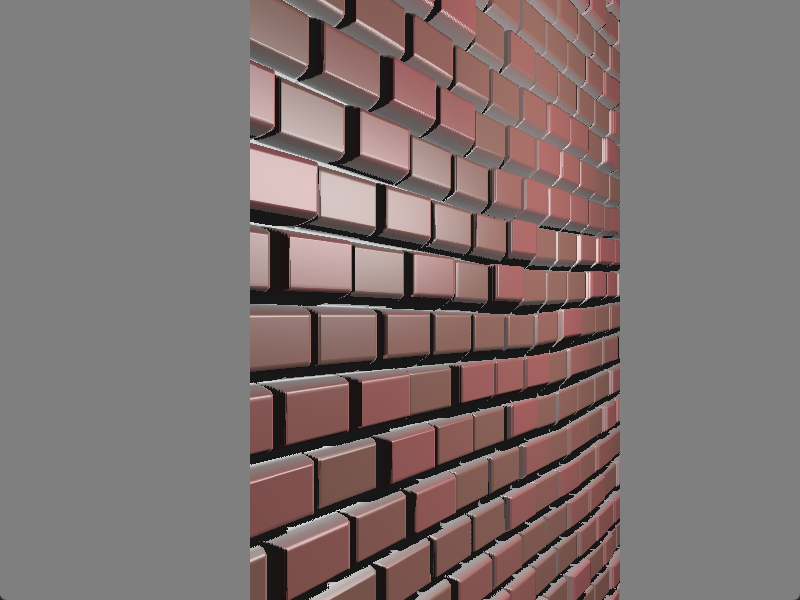

# Chapter28 立方体贴图反射(CubeMap)

[返回](../../README.md)

**立方体贴图**是**环境映射**中使用较为常见的一种纹理类型。
**立方体贴图**由六张独立的图像组成，分别表示投射到立方体六个面的环境。
这六张图像从位于立方体中心的观察者的视角展示环境的景象。

**OpenGL** 提供对立方体贴图纹理的内置支持(使用 **GL_TEXTURE_CUBE_MAP**)。
该纹理使用**三维**纹理坐标 (s, t, r) 进行访问。
纹理坐标被解释为从立方体中心出发的方向向量。
由该向量和立方体中心定义的直线延伸以与立方体的某一个面相交。
然后在交点位置访问对应于该面的图像。

## 28.1 加载立方体贴图

``` C++
GLuint Texture::LoadCubeMap(const std::string& base_name, const std::string& extension = ".png")
{
    GLuint texture = 0;
    const char* suffixes[] = { "posx", "negx", "posy", "negy", "posz", "negz" };
    GLint width = 0;
    GLint height = 0;
    int channels = 0;

    std::string texture_name = base_name + "_" + suffixes[0] + extension;
    stbi_set_flip_vertically_on_load(0);
    unsigned char* data = stbi_load(texture_name.c_str(), &width, &height, &channels, 4);
    if (data)
    {
        glGenTextures(1, &texture);
        glBindTexture(GL_TEXTURE_CUBE_MAP, texture);

        glTexStorage2D(GL_TEXTURE_CUBE_MAP, 1, GL_RGBA8, width, height);
        glTexSubImage2D(GL_TEXTURE_CUBE_MAP_POSITIVE_X, 0, 0, 0, width, height, GL_RGBA, GL_UNSIGNED_BYTE, data);
        stbi_image_free(data);
        data = nullptr;

        for (int i = 1; i < 6; ++i)
        {
            texture_name = base_name + "_" + suffixes[i] + extension;
            data = stbi_load(texture_name.c_str(), &width, &height, &channels, 4);
            if (data)
            {
                glTexSubImage2D(GL_TEXTURE_CUBE_MAP_POSITIVE_X + i, 0, 0, 0, width, height, GL_RGBA, GL_UNSIGNED_BYTE, data);
            }
            stbi_image_free(data);
            data = nullptr;
        }
    }

    glTexParameteri(GL_TEXTURE_CUBE_MAP, GL_TEXTURE_MAG_FILTER, GL_LINEAR);
    glTexParameteri(GL_TEXTURE_CUBE_MAP, GL_TEXTURE_MIN_FILTER, GL_NEAREST);
    glTexParameteri(GL_TEXTURE_CUBE_MAP, GL_TEXTURE_WRAP_S, GL_CLAMP_TO_EDGE);
    glTexParameteri(GL_TEXTURE_CUBE_MAP, GL_TEXTURE_WRAP_T, GL_CLAMP_TO_EDGE);
    glTexParameteri(GL_TEXTURE_CUBE_MAP, GL_TEXTURE_WRAP_R, GL_CLAMP_TO_EDGE);

    return texture;
}
```

创建立方体贴图需要立方体六个面的贴图，加载顺序为: posx->negx->posy->negy->posz->negz。

## 28.2 绑定立方体贴图

``` C++
cube_map_texture = glsl_shader::Texture::LoadCubeMap("../../assets/textures/pisa");

glActiveTexture(GL_TEXTURE0);
glBindTexture(GL_TEXTURE_CUBE_MAP, cube_map_texture);
```

这里将加载完的立方体贴图绑定到位序0上。

## 28.3 将顶点属性变换到世界空间坐标

``` GLSL
world_position = vec3(u_model_matrix * vec4(vertex_position, 1.0));
world_normal = normalize(u_normal_matrix * vertex_normal);
```

因为对天空盒的采样要用到世界空间坐标的法向量，这样可以根据视线方向得出反射方向，然后对立方体贴图进行采样。

## 28.4 计算反射向量并对立方体贴图采样

``` GLSL
vec3 view_direction = normalize(u_camera_world_position - world_position);
vec3 reflect_direction = reflect(-view_direction, normalize(world_normal));
vec3 cube_map_color = texture(u_sky_box_cube_map, reflect_direction).rgb;
```

这里通过相机的世界空间坐标和顶点的世界空间坐标得到视线方向，然后利用顶点法线计算出反射向量，利用反射向量对立方体贴图进行采样得到镜面反射的颜色。

## 28.5 立方体贴图反射渲染展示



[返回](../../README.md)