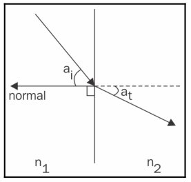

# Chapter28 立方体贴图折射(CubeMap)

[返回](../../README.md)

透明的物体会使通过它们的光线在物体与周围环境的界面处稍微弯曲，这种现象称为折射。
在渲染透明物体时，使用环境贴图并将环境映射到物体上，从而模拟光线通过物体的方式。
即，可以追踪从观察者通过物体的光线(在过程中发生弯曲)，直到到达环境。
然后，将该光线的交点用作物体的颜色。

折射的过程由**斯涅尔定律**描述，该定律定义了入射角与折射角之间的关系：

$$
\frac{\sin a_i}{\sin a_t} = \frac{n_2}{n_1}
$$

**注:** **GLSL** 提供了一个用于计算透射向量的内置函数 `refract`。

## 28.1 立方体贴图折射渲染展示

[返回](../../README.md)