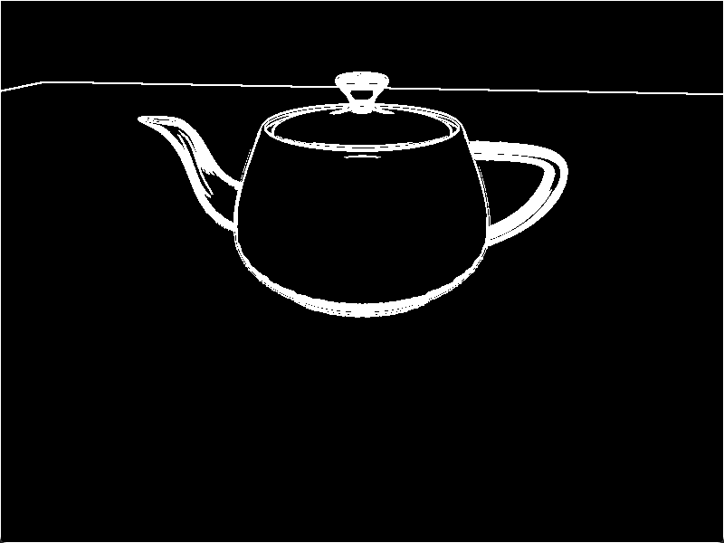

# Chapter34 边缘检测

[返回](../../README.md)

边缘检测是一种图像处理技术，用于识别图像中亮度发生显著变化的区域。
它提供了一种检测物体边界和表面拓扑变化的方法。
它在计算机视觉、图像处理、图像分析和图像模式识别领域有应用。
它还可以用来创建一些视觉上有趣的效果。
例如，它可以使三维场景看起来类似于二维铅笔素描。
为了进行边缘检测，需要先进行正常渲染，然后在第二次处理时应用边缘检测滤波器。

在这里使用的边缘检测滤波器涉及使用卷积滤波器，或称卷积核(也叫滤波器核)。
卷积滤波器是一个矩阵，它定义了如何通过将像素替换为其周围像素值与预定权重的乘积之和来转换像素。

为了应用卷积滤波器，需要访问原始图像的像素以及一个单独的缓冲区来存储滤镜的结果。
通过使用两遍算法来实现。
在第一遍中，将图像渲染到纹理中，然后在第二遍中，通过从纹理读取来应用滤波器，并将滤波后的结果发送到屏幕上。

## 34.1 Sobel算子

基于卷积的最简单的边缘检测技术之一是 **Sobel** 算子。
**Sobel** 算子旨在近似每个像素的图像强度梯度。
它通过应用两个 **3 x 3** 的滤波器来实现。
两个滤波器的结果分别是梯度的垂直分量和水平分量。
然后，使用梯度的幅值作为边缘触发器。
当梯度幅值超过某个阈值时，该像素位于边缘上。

**Sobel** 算子使用的 **3 x 3** 滤波器核如以下方程所示:

$$
S_x=
\begin{bmatrix}
-1 & 0 & 1\\
-2 & 0 & 2\\
-1 & 0 & 1
\end{bmatrix},
\quad
S_y=
\begin{bmatrix}
-1 & -2 & -1\\
0 & 0 & 0\\
1 & 2 & 1
\end{bmatrix}
$$

如果应用 **Sx** 的结果是 **sx**，应用 **Sy** 的结果是 **sy**，那么梯度大小的近似值可以通过以下公式给出:

$$
g=\sqrt{s_x^2+s_y^2}
$$

如果 **g** 的值超过某个阈值，就认为该像素是边缘像素，并在生成的图像中将其高亮显示。

## 34.2 执行边缘检测

``` GLSL
vec4 Pass2()
{
    ivec2 pixel_uv = ivec2(gl_FragCoord.xy);

    float s00 = CalculateLuminance(texelFetchOffset(u_render_texture, pixel_uv, 0, ivec2(-1, 1)).rgb);
    float s10 = CalculateLuminance(texelFetchOffset(u_render_texture, pixel_uv, 0, ivec2(-1, 0)).rgb);
    float s20 = CalculateLuminance(texelFetchOffset(u_render_texture, pixel_uv, 0, ivec2(-1, -1)).rgb);
    float s01 = CalculateLuminance(texelFetchOffset(u_render_texture, pixel_uv, 0, ivec2(0, 1)).rgb);
    float s21 = CalculateLuminance(texelFetchOffset(u_render_texture, pixel_uv, 0, ivec2(0, -1)).rgb);
    float s02 = CalculateLuminance(texelFetchOffset(u_render_texture, pixel_uv, 0, ivec2(1, 1)).rgb);
    float s12 = CalculateLuminance(texelFetchOffset(u_render_texture, pixel_uv, 0, ivec2(1, 0)).rgb);
    float s22 = CalculateLuminance(texelFetchOffset(u_render_texture, pixel_uv, 0, ivec2(1, -1)).rgb);

    float sx = s00 + 2.0 * s10 + s20 - (s02 + 2.0 * s12 + s22);
    float sy = s00 + 2.0 * s01 + s02 - (s20 + 2.0 * s21 + s22);

    float g = sx * sx + sy * sy;

    if (g > u_edge_threshold)
    {
        return vec4(1.0);
    }
    else
    {
        return vec4(0.0,0.0,0.0,1.0);
    }
}
```

## 34.3 边缘检测展示



[返回](../../README.md)