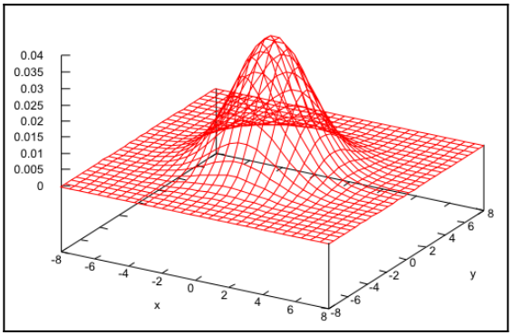

# Chapter35 高斯模糊

[返回](../../README.md)

**模糊滤波器**在许多不同的情况下都很有用，其目标是减少图像中的噪点。
例如，在**边缘检测**之前应用**模糊滤波器**可以通过减少图像中高频波动的数量来改善结果。
任何**模糊滤波器**的基本理念都是是通过加权和将某个像素的颜色与其邻近像素的颜色混合。
权重通常会随着像素距离的增加而减小，因此距离较远的像素对被模糊的像素的贡献要小于距离较近的像素。

高斯模糊使用二维高斯函数来加权邻近像素的贡献:

$$
G(x,y)=\frac{1}{\sqrt{2\pi\sigma^{2}}}\,e^{-\frac{x^{2}+y^{2}}{2\sigma^{2}}}
$$

**σ²** 项是高斯的方差，决定了高斯曲线的宽度。
高斯函数在**(0, 0)**处达到**最大值**，这对应于正在被模糊的像素位置，并且其值会随着x或y的增加而减小。
下图显示了 **σ²** 值为 4.0 的二维高斯函数:

## 35.1 优化高斯模糊算法

直接应用加权和的缺点:
- 由于这是一个 O(n²) 的过程(其中 n 是图像中的像素数量)，因此对于实时使用来说可能太慢。
- 权重的总和必须为一，以避免改变图像的整体亮度。

解决方案: 通过限制给定像素的模糊影响的像素数量(而不是整个图像)以及归一化高斯函数的值来解决上述两个问题。

假设模糊时在片段着色器中需要进行 81 次纹理采样，而片段着色器对每个像素只执行一次。
对于一个 800 x 600 的图像，总的纹理采样次数将是 800 * 600 * 81 = 38,880,000。
采样次数过多，但是可以通过将高斯模糊分两次进行来大幅减少纹理采样次数。

二维高斯函数可以分解为两个一维高斯函数的乘积:

$$
G(x,y)=G(x)\,G(y)
$$

其中，一维高斯函数如下:

$$
G(x)=\frac{1}{\sqrt{2\pi\sigma^{2}}}\,e^{-\frac{x^{2}}{2\sigma^{2}}}
$$

如果 Cij 是像素位置 (i, j) 上像素的颜色，需要计算的和如下:

$$
C_{lm}\leftarrow \sum_{i=-4}^{4}\sum_{j=-4}^{4} G(i,j)\,C_{l+i,\;m+j}
$$

这可以利用二维高斯是两个一维高斯的乘积这一事实来重新写成:

$$
C_{lm}\leftarrow \sum_{i=-4}^{4} G(i)\,\sum_{j=-4}^{4} G(j)\,C_{l+i,\;m+j}
$$

这意味着可以通过两步来计算高斯模糊。
在第一步中，可以计算前面公式中对 j 的求和（垂直求和），并将结果存储在临时纹理中。
在第二步中，使用上一步的结果计算对 i 的求和（水平求和）。

高斯权重必须加起来等于一，才能成为真正的加权平均。因此，需要对高斯权重进行归一化，方程如下:

$$
C_{lm}\leftarrow \sum_{i=-4}^{4}\frac{G(i)}{k}\;\sum_{j=-4}^{4}\frac{G(j)}{k}\;C_{l+i,\;m+j}
$$

方程中的 k 值只是原始高斯权重的总和:

$$
k=\sum_{i=-4}^{4} G(i)
$$

如此，就把 O(n²) 的问题简化成了 O(n) 的问题。

使用三次渲染和两张纹理来实现这一技术。
在第一次渲染中，将整个场景渲染到一张纹理上。
然后，在第二次渲染中，将对第一次渲染得到的纹理应用第一次(垂直)求和，并将结果存储到另一张纹理中。
最后，在第三次渲染中，将对第二次渲染得到的纹理应用水平求和，并将结果发送到默认帧缓冲。

## 34.3 高斯模糊展示

[返回](../../README.md)