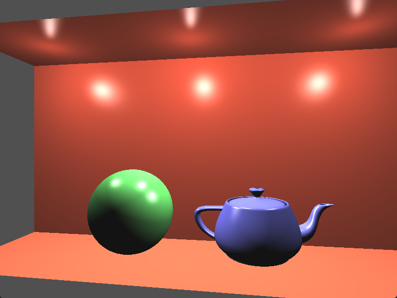

# Chapter36 具有色调映射(tone map)的HDR照明

[返回](../../README.md)

大多数设备(显示器或电视)进行渲染时，通常只支持每个颜色分量 8 位的典型色彩精度，或每像素 2 4位。
因此，对于给定的颜色分量，强度范围被限制在 0 到 255 之间。
在内部，OpenGL 使用浮点值表示颜色强度，提供了更广的值范围和精度。
这些值最终在渲染之前，会通过将浮点范围 [0.0, 1.0] 映射到无符号字节范围 [0, 255] 转换为 8 位值。

然而，真实场景的亮度范围要广得多。
例如，在场景中可见的光源，或它们的直接反射，可能比被光源照亮的物体亮度高出数百到数千倍。
当使用每通道 8 位，或浮点范围 [0.0, 1.0] 时，无法表示这个强度范围。
如果使用更大的浮点值范围，可以在内部更好地表示这些强度，但最终，仍然需要压缩到 8 位范围。

使用更大动态范围计算光照/阴影的过程通常被称为高动态范围渲染(HDR渲染)。

色调映射(Tone mapping)是将宽动态范围的数值压缩到适合输出设备的较小范围的过程。
通常，色调映射是指将某个任意范围的数值映射到 8 位范围内。
目标是保持图像的明暗部分都能被看到，不至于某一部分完全过曝或过暗。

## 36.1 TMO

将一个动态范围映射到较小范围的数学函数称为色调映射算子(Tone Mapping Operator, TMO)。
这些算子通常有两种类型：局部算子和全局算子。
局部算子通过使用当前像素的值以及可能的某些邻近像素的值来确定给定像素的新值。
全局算子则需要整个图像的一些信息来完成其工作。
例如，它可能需要整个图像中所有像素的平均亮度。
其他全局算子则使用整个图像的亮度值直方图来帮助微调映射。

在本章节中，使用一个简单全局算子。
该算子使用图像中所有像素的**对数平均亮度**。
**对数平均亮度**通过对亮度取对数并对这些值求平均，然后再转换回来，如下方的公式所示:

```math
\overline{L}_w = \exp\left(\frac{1}{N}\sum_{x,y}\ln(0.0001 + L_w(x,y))\right)

**Lw(x, y)** 是像素 (x, y) 的亮度。
包含 0.0001 项是为了避免对黑色像素取零的对数。
然后，这个对数平均值被用作如下所示的色调映射操作的一部分:

$$
L(x,y)=\frac{a}{\overline{L}_w}\,L_w(x,y)
$$

方程中的 **a** 项的作用类似于相机中的曝光水平。**a** 的典型值范围是 0.18 到 0.72。
由于这个色调映射算子对暗部和亮部值的压缩有些过度，所以将使用前一个方程的修改版本。
该版本不会对暗部值压缩得那么厉害，并且包括一个最大亮度(Lwhite)，这是一个可配置的值，有助于减少一些极亮的像素:

$$
L_d(x,y)=\frac{L(x,y)\left(1+\frac{L(x,y)}{L_{\mathrm{white}}^{2}}\right)}{1+L(x,y)}
$$

## 36.2 CEI XYZ

本章节涉及切换颜色空间。
将场景转换为将**亮度**与**色度**分离的颜色空间，那么就可以独立地改变亮度值。
**CIE XYZ** 颜色空间正好满足需求。
**CIE XYZ** 颜色空间的设计使 **Y** 分量描述颜色的亮度，而色度可以通过两个衍生参数(x 和 y)确定。
衍生的颜色空间称为 **CIE xyY** 空间。**Y** 分量包含亮度，而 **x** 和 **y** 分量包含色度。
通过转换到 **CIE xyY** 空间，已将**亮度**与**色度**分离，从而可以在不影响感知颜色的情况下更改**亮度**。

因此，这个过程涉及从 **RGB** 转换到 **CIE XYZ**，然后转换到 **CIE xyY**，修改亮度，然后逆向操作回到 **RGB**。
从 **RGB** 转换到 **CIE XYZ**可以用一个转换矩阵来描述。

从 **XYZ** 转换到 **xyY** 包含以下步骤:

$$
x=\frac{X}{X+Y+Z},\qquad y=\frac{Y}{X+Y+Z}
$$

最后，将 **xyY** 转换回 **XYZ** 使用以下公式进行:

$$
X=\frac{Y}{y}\,x,\qquad Z=\frac{Y}{y}\,(1-x-y)
$$

**注:** 更多内容参考 [这里](http://www.brucelindbloom.com/index.html?Eqn_XYZ_to_RGB.html)。

## 36.3 步骤

涉及的步骤如下：
1. 将场景渲染到高分辨率纹理。
2. 在CPU上计算对数平均亮度。
3. 渲染一个充满屏幕的四边形，以对每个屏幕像素执行片段着色器。
在片段着色器中，从步骤1创建的纹理中读取数据，应用色调映射操作，并将结果输出到屏幕。

要进行设置，创建一个高分辨率纹理(使用 GL_RGB32F 或类似格式)，并将其附加到带有深度附件的帧缓冲区。
设置片段着色器，使用 uniform 来选择渲染通道。
顶点着色器可以简单地传递眼坐标中的位置和法线。

## 36.4 HDR照明展示



[返回](../../README.md)