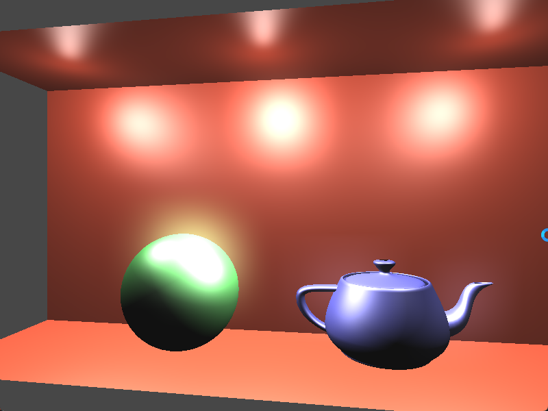

# Chapter37 泛光特效(Bloom)

[返回](../../README.md)

泛光效应是一种视觉效果，图像中明亮的部分似乎有延伸到图像较暗部分之外的边缘。
这种效果的基础在于相机和人类视觉系统感知高对比度区域的方式。
由于所谓的艾里圆盘(airy disc)，亮光源会渗入图像的其他区域，艾里圆盘是光线通过孔径时产生的衍射图样。

在人工CG渲染中产生这种效果需要确定图像中哪些部分足够亮，提取这些部分，进行模糊处理，然后与原始图像重新组合。
通常，泛光效果与 **HDR** 渲染相关。
通过 **HDR** 渲染，可以表示每个像素的更大强度范围。
由于可以表示更广范围的亮度值，因此在与 **HDR** 渲染结合使用时，泛光效果更加准确。

尽管 **HDR** 能产生更高质量的效果，但在使用标准(非 **HDR**)颜色值时仍然可以产生辉光效果。
结果可能没有那么显著，但涉及的原理在两种情况下都是相似的。

## 37.1 步骤

使用五个 **Pass** 来实现泛光效果，包括四个主要步骤:

1. 在第一个 **Pass** 中，将场景渲染到 **HDR** 纹理中。
2. 在第二个 **Pass** 中，提取图像中比某个阈值更亮的部分。
使用亮度通道滤波器。在应用此滤镜时，还会将图像下采样到较低分辨率的缓冲区。
之所以这样做，是因为当使用线性采样器从该缓冲区读取时，图像会额外得到模糊效果。
3. 在第三个 **Pass** 和 第四个 **Pass** 中将对亮部应用 [高斯模糊](../chapter35/Chapter35.md)。
4. 在第五个 **Pass** 中，应用色调映射，并将色调映射的结果添加到模糊的高光通道滤波器结果中。

**注:** 更多内容参考 [这里](https://learnopengl-cn.github.io/05%20Advanced%20Lighting/07%20Bloom/)。

## 37.2 泛光特效展示

[返回](../../README.md)