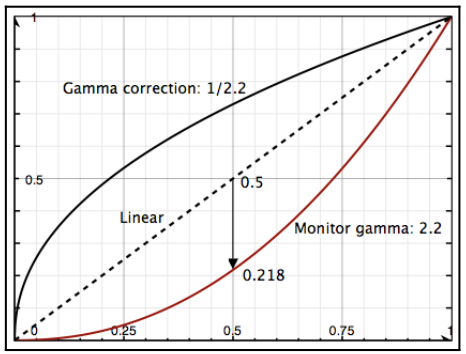

# Chapter38 Gamma校正

[返回](../../README.md)

电脑显示器对像素强度的响应是非线性的。
例如，如果没有伽马校正，灰度值 0.5 并不会看起来是值 1.0 的一半亮，而是会显得比其应有的亮度更暗。

下图中的下曲线显示了典型显示器(伽马值为2.2)的响应曲线。
**x** 轴表示亮度，**y** 轴表示感知亮度。
虚线表示线性亮度值。
上曲线表示对线性值应用伽马校正。
下曲线表示典型显示器的响应。
在具有类似响应曲线的屏幕上，灰度值为 0.5 看起来会有 0.218 的亮度。



典型显示器的非线性响应通常可以用一个简单的幂函数来建模。
感知强度(**P**)与像素强度(**I**)的幂成正比，这个幂通常被称为伽马:

``` math
P = I^{\gamma}
```

为了补偿这种非线性响应，可以在将结果发送到输出帧缓冲之前应用伽马校正。
伽马校正涉及将像素强度提高到某个指数，以补偿显示器的非线性响应，从而获得看起来线性的感知结果。
将线性空间的值提高到 1/γ 次方就可以达到效果:

``` math
I = \left(I^{\frac{1}{\gamma}}\right)^{\gamma}
```

## 38.1 Gamma校正展示


[返回](../../README.md)