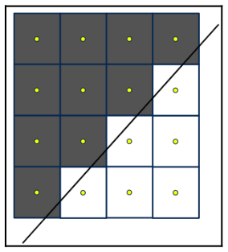
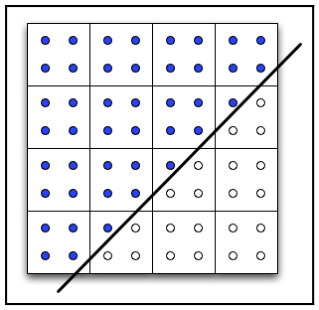

# Chapter39 多重采样抗锯齿(MSAA)

[返回](../../README.md)

抗锯齿是一种消除或减少锯齿伪影视觉影响的技术，当高分辨率或连续信息以较低分辨率呈现时，锯齿伪影就会出现。
在实时图形中，锯齿通常表现为多边形边缘参差不齐，或高变化纹理的视觉失真。

## 39.1 MSAA

多重采样抗锯齿涉及对每个像素计算多个样本，并将这些样本的结果结合起来以确定像素的最终值。
样本位于像素范围内的各个点。大多数样本会落在多边形内部，但对于靠近多边形边缘的像素，一些样本可能会落在外部。
片元着色器通常像往常一样每个像素只执行一次。
例如，对于 **4** 倍多重采样抗锯齿(**MSAA**)，光栅化的频率是四倍。
对于每个像素，片元着色器执行一次，其结果会根据四个样本中有多少落在多边形内进行缩放。

**OpenGL** 已经支持多重采样有一段时间了，而且使用起来几乎是透明的。
它只是简单地通过开启或关闭来实现的。
它的工作原理是使用额外的缓冲区来存储处理过程中的子像素样本。
然后，将这些样本组合在一起，生成片元的最终颜色。
这几乎都是自动完成的，程序员几乎无法调节结果。

## 39.2 插值限定符

在 **GLSL** 中有两个插值限定符，允许程序员微调多重采样的一些方面。它们是 `sample` 和 `centroid`。

## 39.2.1 背景知识

一个片元是否处于多边形内，是通过确定该像素中心的位置来判断的。
如果中心位于多边形内，该像素就会被着色，否则不会。

上图显示了没有 **MSAA** 时多边形边缘附近的像素。
线条表示多边形的边界。
灰色像素被认为在多边形内部。
白色像素在外部，不会被着色。
点表示像素的中心位置。

## 39.2.2 插值

插值变量(片元着色器的输入变量)的值是相对于每个片段的中心进行插值的，而片段的中心总是位于多边形内部。
当启用多重采样抗锯齿时，会在片元的不同位置计算每个片段的多个样本。
如果这些样本中的任何一个位于多边形内，则着色器至少会为该像素执行一次(但不一定为每个样本执行)。

以下图片表示多边形边缘附近的像素。
点表示采样点。
黑色采样点位于多边形内部，白色采样点位于多边形外部。
如果任何一个采样点位于多边形内部，则该像素的片段着色器会被执行(通常只执行一次)。

**注:** 对于某些像素，像素中心位于多边形外部。因此，在使用多重采样抗锯齿(**MSAA**)时，片段着色器在多边形边缘附近可能会略微多执行一次。

片元着色器输入变量的值通常会被插值到像素的中心，而不是插值到任何特定样本的位置。
即，片元着色器使用的值是通过插值到片段中心的位置来确定的，而这个中心可能位于多边形之外。
如果依赖于片段着色器的输入变量严格在顶点值之间进行插值(而不超出该范围)，那么这可能会导致意外的结果。

**注:** 当知道输入变量的插值不应超出这些变量在顶点处的取值时，应使用 `sample` 和 `centroid`。

## 38.1 Gamma校正展示

[返回](../../README.md)