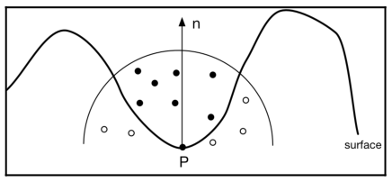
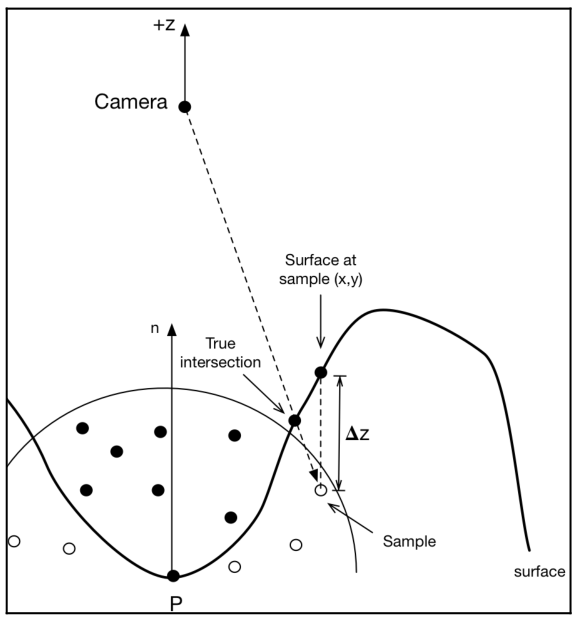

# Chapter41 屏幕空间环境光遮蔽(SSAO)

[返回](../../README.md)

环境光遮蔽是一种基于假设表面从各个方向接收均匀光照的渲染技术。
由于附近的物体会遮挡部分光线，有些表面位置接收到的光照会比其他位置少。
如果表面点附近有很多局部几何体，一些环境光照会被阻挡，使该点变得更暗。

## 41.1 环境光遮蔽原理

环境光遮蔽是通过测试从以表面点为中心的上半球观察表面点的可见性来计算的。

如上图所示的点 **A** 和 点 **B**，点 **A** 位于表面的一个角附近，而点 **B** 位于一个平坦区域。
箭头表示可见性测试的方向。
在点 **B** 上方的半球中，所有方向都是无遮挡的，这意味着这些光线不会与任何几何体相交。
然而，在点 **A** 上方的半球中，大约一半的方向被遮挡(虚线箭头)。
因此，**A** 接收到的光照较少，看起来比点 **B** 更暗。

本质上，环境光遮蔽归结为以下过程。
在表面点周围的上半球尽可能多地采样方向。
测试每个方向的可见性(遮蔽情况)。
未被遮蔽的光线所占的比例即为该点的环境光遮蔽因子。

这个过程通常需要大量样本才能产生可接受的结果。
对网格的每个顶点都这样做，在复杂场景下实时操作是不可行的。
然而，对于静态场景，结果可以预先计算并存储在纹理中。
如果几何体可以移动，需要一些与场景复杂性无关的近似方法。

## 41.2 SSAO 介绍

屏幕空间环境光遮蔽(SSAO)是一类算法的名称，这类算法试图利用屏幕空间信息实时近似环境光遮蔽。
换句话说，通过 SSAO，在场景渲染完成后，通过后处理计算环境光遮蔽，利用存储在深度缓冲区和/或几何缓冲区的数据。
SSAO 自然地与**延迟着色**配合使用，但也已经在**前向渲染**器中实现过。

在本章节中，将实现 SSAO 作为**延迟渲染**过程的一部分。
将在每个屏幕空间像素上计算环境光遮蔽因子，而不是在场景中每个物体的表面上计算，同时忽略摄像机无法看到的几何体。
在**延迟着色**渲染器的第一个 Pass 之后，在 G 缓冲区中拥有每个屏幕像素可见表面位置的位置信息、法线信息和颜色信息。
对于每个像素，将使用位置和法向量来定义表面点上方的半球体。
然后，将在该半球体内随机选择位置(采样点)，并测试每个位置的可见性:

上图表示点 P 的遮挡测试。
实心和空心圆圈是沿法向矢量为中心，在 P 点上方半球内随机选择的采样点。
空心圆未通过可见性测试，实心圆通过了测试。

## 41.3 可见性判断

为了准确测试可见性，需要从表面点向所有样本点发射光线，并检查每条光线是否与表面相交。
然而，这个过程是非常耗时的。
所以，通过以下方式估算可见性: 如果该点从相机可见，那么就判断它从表面点也可见。
这在某些情况下可能不准确，但对于各种典型场景来说，这是一个很好的近似方法。

实际上，不会从摄像机追踪一条射线到表面点，只是比较被测试点和摄像机空间中相同 (x, y) 位置的表面点的 z 坐标。
这会引入另一小部分误差，但在实际中不足以引起反感。下图说明了这一概念:

对于在半球内测试的每一个样本，都会在相机可见表面上找到对应的位置，该位置在相机坐标中与样本具有相同的 (x,y) 位置。
这个位置就是在样本的 (x,y) 位置的位置信息 G-buffer 中的值。
然后，比较样本与表面点的 z 坐标。如果表面点的 z 坐标大于样本的 z 坐标(使用相机坐标系，所以所有 z 坐标都是负数)，那么认为该样本被表面遮挡。

## 41.4 步骤

1. 第一个 Pass 将数据渲染到 G 缓冲区: 相机空间位置、法线和基础颜色。
2. 第二个 Pass 计算每个屏幕像素的环境遮挡因子。
3. 第三个 Pass 对环境光遮蔽数据进行简单模糊，以去除高频伪影。
4. 第四个 Pass 是光照计算。计算反射模型，并整合环境光遮蔽。

最后三个 Pass 使用的是屏幕空间技术，这意味着只需渲染一个填满屏幕的四边形，就可以为屏幕上的每个像素调用一次片元着色器。
场景的实际几何只在第一个 Pass 中渲染。
大部分有趣的内容发生在第二个 Pass。
在这里，需要在每个点的表面上方的半球内生成若干随机点。
在着色器中生成随机数有许多挑战，这里不详细讨论。
本章节不会生成随机数，而是预先生成一组以 z 轴为中心的半球随机点，称为随机核。
将在每个点处重复使用这个核，通过将点转换到相机空间，将核的 z 轴与表面点的法向量对齐。
为了进一步增加一点随机性，还会沿着法向量将核旋转一个随机的角度。

## 40.1 延迟渲染的优缺点

在图形学社区中，延迟着色的相对优缺点一直存在一些争论。
延迟着色并不适用于所有情况。
它在很大程度上取决于应用的具体需求，在决定是否使用延迟着色之前，需要仔细评估其优点和缺点。

**注:** 在最近的 OpenGL 版本中，通过使用 `GL_TEXTURE_2D_MULTISAMPLE`，可以实现具有延迟着色的多样本抗锯齿。

延迟渲染在混合/透明处理方面表现不佳。
使用带有深度剥离的额外缓冲区可以通过在 **G** 缓冲区中存储额外的分层几何信息来提供帮助。

延迟着色的一个显著优点是可以保留第一次渲染的深度信息，并在着色阶段将其作为纹理来访问。
能够将整个深度缓冲作为纹理访问可以实现一些算法，例如景深(深度模糊)、屏幕空间环境光遮蔽、体积粒子以及其他类似技术。

## 40.2 屏幕空间环境光遮蔽展示

[返回](../../README.md)