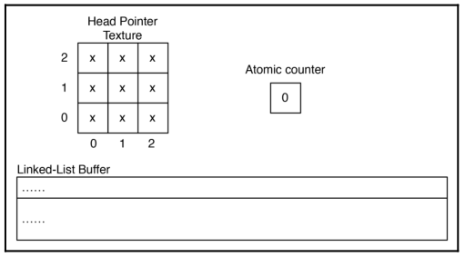
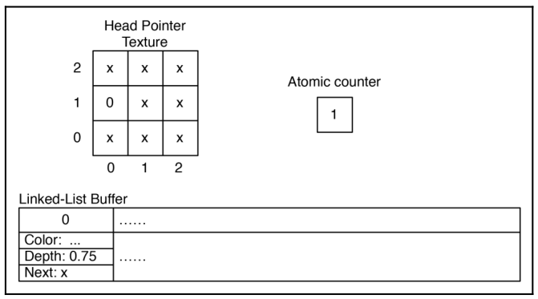
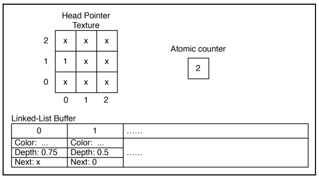
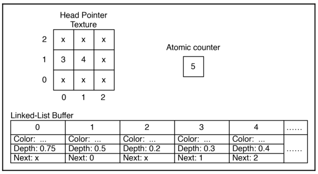

# Chapter42 顺序无关的透明物体渲染

[返回](../../README.md)

在像 OpenGL 这样的流水线架构中，要精确实现透明效果可能很困难。
一般的技术是先绘制不透明物体，同时启用深度缓冲区，然后将深度缓冲区设为只读(使用 glDepthMask)，禁用深度测试，再绘制透明几何体。
然而，需要注意确保透明几何体是从远到近绘制的。
也就是说，距离观察者较远的物体应先绘制，距离较近的物体随后绘制。
这就需要在渲染之前进行某种深度排序。

无序透明度(OIT)意味着可以以任何顺序绘制对象，并且仍然获得准确的结果。
深度排序在其他某个层面上完成，可能是在片元着色器中进行，因此程序员无需在渲染前对对象进行排序。
实现这一点的方法有多种，一种最常见的技术是为每个像素保存颜色列表，按深度排序，然后在片元着色器中将它们混合在一起。
在本章节中，将使用这种技术来实现 OIT。

着色器存储缓冲对象(SSBO)和图像加载/存储是 OpenGL 中的一些最新功能，分别在 4.3 和 4.2 中引入。
它们允许从着色器内部对数据进行任意的读/写访问。
着色器只能写入受控的、隔离的位置，例如片元着色器输出和变换反馈缓冲区。
这是有充分理由的。
由于着色器可以并行执行，并且执行顺序看似任意，因此很难确保着色器实例之间的数据一致性。
一个着色器实例写入的数据可能对另一个着色器实例不可见，无论该实例是否在另一个实例之后执行。
尽管如此，仍有充分的理由希望能够读写共享位置。
随着 SSBO 和图像加载/存储的出现，现在已经具备了这种能力。
可以创建缓冲区和纹理(称为图像)，并对任何着色器实例进行读/写访问。
然而，这种能力是有代价的。
程序员现在必须非常小心，以避免因向多个并行线程共享的内存写入而产生的内存一致性错误。
此外，程序员还必须注意着色器调用之间同步带来的性能问题。

## 42.1 OIT 基本原理

在本章节中，将使用 SSBO 和图像加载/存储来实现顺序无关透明。
使用两个 Pass。第一个 Pass 中，会渲染场景几何体，并为每个像素存储一个片元的链表。
经过第一个 Pass 后，每个像素都会有一个对应的链表，其中包含写入该像素的所有片元，包括它们的深度和颜色。
在第二个 Pass 中，将绘制一个全屏四边形，以便为每个像素调用片元着色器。
在片元着色器中，会提取该像素的链表，按深度排序片元(从大到小)，然后按顺序混合颜色。
最后的颜色将发送到输出设备。

为此，需要三个在片元着色器实例之间共享的内存对象:
- 原子计数器: 这只是一个无符号整数，用它来跟踪链表缓冲区的大小。可以把它看作缓冲区中第一个未使用槽的索引。
- 一个与屏幕尺寸对应的头指针纹理: 该纹理将在每个像素单元中存储一个无符号整数。该值是对应像素的链表头的索引。
- 一个包含所有链表的缓冲区: 缓冲区中的每一项都对应一个片元，并包含一个结构体，其中包含片元的颜色和深度，以及一个整数，该整数是链表中下一个片元的索引。

## 42.2 生成链表和头指针纹理

为了理解这一切是如何协同工作的，例举一个简单的例子。
假设屏幕宽三像素，高三像素。
将有一个头指针纹理，其尺寸相同，并且将所有的纹素初始化为一个特殊值，表示链表的结束(空列表)。
在下图中，这个值显示为 x，但在实际操作中，会使用 0xffffffff。
计数器的初始值为零，链表缓冲区分配了特定大小，但最初被视为空。内存初始状态如下图所示:

现在假设一个片元在位置 (0, 1) 被渲染，深度为 0.75。片元着色器将执行以下步骤:

1. 增加原子计数器。新值将为 1，但将使用先前的值(0)作为链表中新节点的索引。

2. 使用计数器(0)的先前值更新 (0, 1) 处的头指针纹理。
这是该像素的链表新头的索引。
保留之前存储在那里的值 (x)，因为在下一步中需要它。

3. 在与计数器先前值(0)对应的位置将一个新值添加到链表缓冲区中。
在此存储片元的颜色及其深度。
在下一个组件中存储在步骤2中保留的位于(0, 1)的头指针纹理的先前值。
在这种情况下，它是表示列表末尾的特殊值。

经过这些步骤之后，内存状态如下图所示:

现在，假设另一个片元在 (0, 1) 处渲染，深度为 0.5。
片元着色器将执行与之前相同的步骤，得到如下内存布局:

现在有一个从索引 1 开始、以索引 0 结束的双元素链表。
假设现在有三个更多的片元，顺序如下:
一个位于 (1, 1) 的片元，深度为 0.2；
一个位于 (0, 1) 的片元，深度为 0.3；
以及一个位于 (1, 1) 的片元，深度为 0.4。
对每个片元按照相同的步骤操作，得到以下结果:

链表(0, 1)由片元{3, 1, 0}组成，链表(1, 1)包含片元{4, 2}。

由于 GPU 的高度并行特性，片元几乎可以以任意顺序进行渲染。
例如，来自两个不同多边形的片元可能会以与多边形绘制指令发出顺序相反的顺序通过管线。
作为程序员，不能期望片元具有任何特定的顺序。
实际上，来自片元着色器不同实例的指令可能会以任意方式交错。
唯一可以确定的是，特定着色器实例中的语句会按顺序执行。
然而，前面三个步骤的任何交错执行仍然会导致一致的状态。
例如，假设实例一执行步骤1和步骤2，然后另一个实例(也许是在相同的片段坐标的另一个片段)执行步骤1、2和3，而在此之前第一个实例还没有执行步骤3。
结果仍然会一致吗？会一致。

**注:** 不仅不同实例的着色器中的语句可以相互交错，而且组成语句的子指令也可以交错。
更重要的是，它们实际上可能同时执行。因此，如果不小心，可能会出现糟糕的内存一致性问题。
为了避免这种情况，需要谨慎使用 GLSL 对原子操作的支持。

OpenGL 4.2 和 4.3 引入了实现该算法所需的工具。
OpenGL 4.2 引入了原子计数器以及在纹理中读取和写入任意位置的能力(称为图像加载/存储)。
OpenGL 4.3 引入了着色器存储缓冲对象。

## 42.2 顺序无关的透明物体渲染展示

[返回](../../README.md)