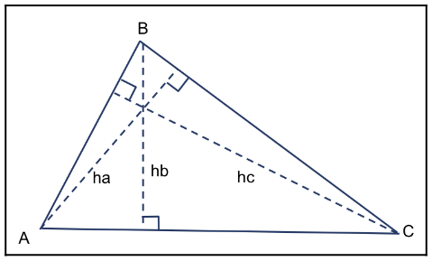
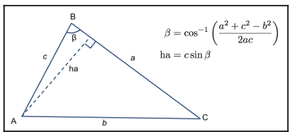

# Chapter44 在带阴影的网格上绘制线框

[返回](../../README.md)

## 44.1 几何着色器简介

几何着色器(GS)设计为每个图元执行一次。
它可以访问该图元的所有顶点，以及与每个顶点相关联的任何输入变量的值。
即，如果前一阶段(例如顶点着色器)提供了一个输出变量，几何着色器可以访问该图元中所有顶点的该变量值。
因此，几何着色器中的输入变量始终是数组。

几何着色器可以输出**零**个、一个或多个图元。
这些图元不必与几何着色器接收的图元种类相同。

几何着色器(GS)只能输出一种基本类型。
例如，几何着色器可以接收一个三角形，并将多个线段输出为一个线带，
或者几何着色器可以接收一个三角形，并将零个或多个三角形输出为一个三角带。

几何着色器(GS)能够以多种不同方式运行。
几何着色器可以负责根据某些标准剔除几何图形，例如基于遮挡的可见性。
它可以生成额外的几何图形，以增强正在渲染的对象的形状。
几何着色器可以简单地计算有关图元的额外信息，并保持图元不变地传递下去，
也可以生成与输入几何图形完全不同的图元。

几何着色器(GS)的功能围绕两个内置函数展开:
- `EmitVertex`: 几何着色器为特定顶点定义输出变量，然后调用 `EmitVertex`，之后，几何着色器可以重新定义下一个顶点的输出变量，再次调用 `EmitVertex`，以此类推。如果几何着色器完全没有调用 `EmitVertex`，输入的图元会被丢弃(不会被渲染)。
- `EndPrimitive`: 在发射完一个图元的所有顶点后，几何着色器可以调用 `EndPrimitive`，让 OpenGL 系统知道该图元的所有顶点都已发射完毕。当几何着色器执行结束时，`EndPrimitive` 函数会被隐式调用。

## 44.2 计算三角形的高

为了在带阴影的网格上方渲染线框，需要计算每个片元到最近三角形边缘的距离。
当片元距离边缘在特定范围内时，会对其进行着色并与边缘颜色混合。否则，片元将按正常方式着色。

为了计算片元到边缘的距离，使用以下技术:
在几何着色器中，计算每个顶点到对边的最小距离(也称三角形的高)。
在下图中，所需的距离分别是 ha、hb 和 hc:

可以利用三角形的内角来计算这些高，而内角可以通过余弦定理确定。
例如，要找到 ha，使用顶点C处的内角(β):

其他高可以用类似的方法计算。
(注意，β可能大于 9 0度，在这种情况下，需要取 180-β 的正弦值。
不过，180-β 的正弦值与 β 的正弦值是相同的)
一旦计算出这些三角形的高，就可以在几何着色器中创建一个输出向量(边缘距离向量)，用于在三角形上进行插值。
该向量的各个分量表示片段到三角形各边的距离。

x 分量表示到边 a 的距离，y 分量表示到边 b 的距离，z 分量表示到边 c 的距离。
如果在顶点处为这些分量分配正确的值，硬件会自动对其进行插值，提供每个片段到各边的相应距离。
在顶点 A 处，这个向量的值应该是 `(ha, 0, 0)`，因为顶点 A 到边 a 的距离为 ha，且正好在边 b 和边 c 上。
同样，顶点 B 的值为 `(0, hb, 0)`，顶点 C 的值为 `(0, 0, hc)`。
当这三个值在三角形上进行插值时，就能得到片元到三条边中每条边的距离。
在屏幕空间中完成所有这些计算。也就是说，会先在几何着色器中将顶点变换到屏幕空间，然后再计算高。

由于是在屏幕空间中工作，因此不需要以透视校正的方式对值进行插值。
所以需要注意告诉硬件进行线性插值。
在片元着色器中，要做的就是找到这三个距离中的最小值，如果该距离小于线宽，就将片元颜色与线条颜色进行混合。
还可以在这个过程中应用一些抗锯齿处理。
为此，将使用 GLSL 的 `smoothstep` 函数来使线条边缘渐变。
在线条边缘周围两像素的范围内缩放线条的强度。
距离线条实际边缘1个像素或更近的像素将完全呈现线条颜色，距离线条边缘1个像素或更远的像素则不呈现线条颜色。
在这两者之间，使用 `smoothstep` 函数创建平滑过渡。
当然，线条本身的边缘与多边形边缘之间的距离是可配置的(称之为Line.Width)。

## 44.3 在带阴影的网格上绘制线框展示

[返回](../../README.md)