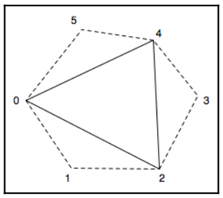

# Chapter45 使用几何着色器绘制轮廓线

[返回](../../README.md)

当想要实现卡通风格或手绘风格的渲染效果时，通常需要在模型边缘以及棱边或折痕周围绘制黑色轮廓。
在本章节中，探讨一种使用几何着色器实现该效果的技术——通过生成与物体轮廓边缘对齐的细小四边形来模拟轮廓线。

更多内容可以查看 [这里](https://prideout.net/blog/?p=54)。

## 45.1 几何着色器简介

几何着色器(GS)设计为每个图元执行一次。
它可以访问该图元的所有顶点，以及与每个顶点相关联的任何输入变量的值。
即，如果前一阶段(例如顶点着色器)提供了一个输出变量，几何着色器可以访问该图元中所有顶点的该变量值。
因此，几何着色器中的输入变量始终是数组。

几何着色器可以输出**零**个、一个或多个图元。
这些图元不必与几何着色器接收的图元种类相同。

几何着色器(GS)只能输出一种基本类型。
例如，几何着色器可以接收一个三角形，并将多个线段输出为一个线带，
或者几何着色器可以接收一个三角形，并将零个或多个三角形输出为一个三角带。

几何着色器(GS)能够以多种不同方式运行。
几何着色器可以负责根据某些标准剔除几何图形，例如基于遮挡的可见性。
它可以生成额外的几何图形，以增强正在渲染的对象的形状。
几何着色器可以简单地计算有关图元的额外信息，并保持图元不变地传递下去，
也可以生成与输入几何图形完全不同的图元。

几何着色器(GS)的功能围绕两个内置函数展开:
- `EmitVertex`: 几何着色器为特定顶点定义输出变量，然后调用 `EmitVertex`，之后，几何着色器可以重新定义下一个顶点的输出变量，再次调用 `EmitVertex`，以此类推。如果几何着色器完全没有调用 `EmitVertex`，输入的图元会被丢弃(不会被渲染)。
- `EndPrimitive`: 在发射完一个图元的所有顶点后，几何着色器可以调用 `EndPrimitive`，让 OpenGL 系统知道该图元的所有顶点都已发射完毕。当几何着色器执行结束时，`EndPrimitive` 函数会被隐式调用。

## 45.3 几何着色器邻接模式

几何着色器最重要的特性之一是允许我们提供超出当前渲染图元本身的额外顶点信息。
当几何着色器被引入 OpenGL 时，也新增了几种图元渲染模式，这些邻接模式(adjacency modes)允许为每个图元关联额外的顶点数据。
通常，这些额外信息与网格中相邻图元相关，但并非强制要求(实际上，也可将这些额外信息用于其他用途)。
以下是邻接模式的列表及简要说明：

- `GL_LINES_ADJACENCY`: 此模式定义带有相邻顶点的线段(每个线段对应 4 个顶点)。
- `GL_LINE_STRIP_ADJACENCY`: 此模式定义带有相邻顶点的线带(n 条线段对应 n+3 个顶点)。
- `GL_TRIANGLES_ADJACENCY`: 此模式定义三角形及其相邻三角形的顶点(每个图元对应 6 个顶点)。
- `GL_TRIANGLE_STRIP_ADJACENCY`: 此模式定义三角带及其相邻三角形的顶点(n 个三角形对应 2 (n+2) 个顶点)。

在本章节中采用 `GL_TRIANGLES_ADJACENCY` 模式:



在上图中，实线代表三角形本身，虚线代表相邻三角形。
第 1、3、5 个顶点(索引 0、2、4)构成当前三角形，第 2、4、6 个顶点(索引 1、3、5)则是相邻三角形的顶点。

## 45.4 几何着色器中判断物体轮廓

当网格以包含邻接信息的模式渲染时，几何着色器可以访问与特定三角形关联的所有 6 个顶点。
随后，利用这些相邻三角形来判断某条三角形边缘是否属于物体的轮廓。
核心判断依据是：若某条边缘所在的三角形为正面朝向，而对应的相邻三角形为背面朝向，则该边缘为轮廓边缘。

在几何着色器中，通过计算三角形的法向量(使用叉积)来判断三角形是否为正面朝向。
若在视空间坐标下计算，法向量的 z 分量为正时，三角形为正面朝向。
因此，只需计算法向量的 z 分量即可，这能节省一些计算资源。
对于由顶点 A、B、C 构成的三角形，其法向量的 z 分量可通过以下公式计算:

``` math
n_z = (A_x B_y - B_x A_y) + (B_x C_y - C_x B_y) + (C_x A_y - A_x C_y)
```

一旦确定了哪些边缘是轮廓边缘，几何着色器就会生成与这些轮廓边缘对齐的细小四边形。
这些四边形组合起来，就能形成所需的黑色轮廓线。
生成所有轮廓四边形后，几何着色器还会输出原始的三角形。

## 45.5 使用几何着色器绘制轮廓线展示


[返回](../../README.md)