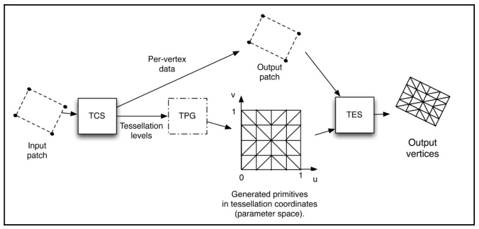

# Chapter46 细分曲线

[返回](../../README.md)

## 46.1 细分着色器简介

当细分着色器处于激活状态时，仅能渲染一种图元——面片(GL_PATCHES)。
若在细分着色器激活时渲染其他类型的图元(如三角形、线段)，会触发错误。
面片是由开发者完全定义的任意几何块(或信息块)，其几何含义仅由 **细分控制着色器(TCS)** 和 **细分评估着色器(TES)** 决定，除此之外无默认几何解释。
面片的顶点数量同样可配置，每个面片的最大顶点数由具体实现决定，可通过以下命令查询:

``` C++
glGetIntegerv(GL_MAX_PATCH_VERTICES, &max_vertices);
```

可通过以下函数定义每个面片的顶点数:

``` C++
glPatchParameteri(GL_PATCH_VERTICES, num_patch_vertices);
```

面片最常见的应用场景是作为控制点集合，用于定义插值曲面或曲线(如贝塞尔曲线、贝塞尔曲面)。
但面片包含的信息也可用于其他用途，并非局限于几何插值。

需要注意的是，面片本身不会被直接渲染，
而是作为 **细分控制着色器(TCS)** 和 **细分评估着色器(TES)** 的额外信息来源。
真正向下一阶段传递的图元由位于 TCS 和 TES 之间的**细分图元生成器(Tessellation Primitive Generator, TPG)** 创建。
可将细分图元生成器视为一个可配置的 “引擎”，它能基于一组标准细分算法生成图元。
TCS 和 TES 均可访问整个输入面片，但职责存在本质区别:
- 细分控制着色器(TCS)的职责:
    - 配置 **细分图元生成器(TPG)**
    - 定义 TPG 生成图元的方式(数量、算法)
    - 生成每个顶点的输出属性
- 细分评估着色器(TES)的职责:
    - 确定 TPG 生成的图元中每个顶点的位置(及其他信息，如法向量、纹理坐标)

例如，TCS 可能指示 TPG 生成包含 100 条线段的线带，而 TES 则负责计算这 100 条线段中每个顶点的位置——这一过程通常需要利用整个面片的信息。

细分控制着色器(TCS)会针对面片的每个顶点执行一次，但可访问整个面片的所有顶点。
它可计算面片的额外信息并传递给 TES(通过输出变量)，但其最重要的任务是通过内置数组 `gl_TessLevelInner` 和 `gl_TessLevelOuter` 告知 TPG 应生成的图元数量。
这两个数组定义了 TPG 生成细分图元的精细程度。

细分图元生成器(TPG)基于特定算法(四边形、等值线、三角形)生成图元，不同算法生成图元的方式略有差异。
生成的每个顶点都会关联一个参数空间坐标 `(u, v, w)`，每个坐标的取值范围为 0~1，可用于计算顶点位置。

不同图元生成算法生成顶点(及关联参数坐标)的方式略有不同:
四边形和等值线的细分算法仅使用前两个参数坐标 `(u, v)`。
下图展示了输入面片和输出面片均包含 4 个顶点的场景，其中 TPG 使用四边形细分算法，且内部分级和外部分级均设为 4。



**注:** 输入面片的顶点数与输出面片的顶点数不必相同。

细分评估着色器(TES)会针对 TPG 生成的每个参数空间顶点执行一次。
有趣的是，TES 实际上是定义 TPG 所用算法的着色器——它通过输入布局限定符指定算法类型。
如前所述，TES 的主要职责是确定顶点位置(及其他信息，如法向量、纹理坐标)，通常会结合 TPG 提供的参数坐标 `(u, v)` 和输入面片所有顶点的位置来完成计算。
例如，绘制曲线时，面片可能包含 4 个顶点(曲线的控制点)；
若细分级别设为 100，TPG 会生成 101 个顶点以构成线带，每个顶点的 u 坐标在 0~1 范围内合理分布；
TES 则会结合该 u 坐标和 4 个面片顶点的位置，计算当前着色器执行所关联顶点的位置。

## 46.2 细分曲线简介

在计算机图形学中，曲线细分是将简单曲线(如由少量控制点定义的贝塞尔曲线)转换为更精细、平滑的折线或多边形的过程。
细分着色器(Tessellation Shader)为这一过程提供了高效的 GPU 加速支持，无需在 CPU 端预计算大量顶点数据。
本章节将以 4 个控制点的贝塞尔曲线为例，使用细分着色器实现曲线细分。

### 46.2.1 贝塞尔曲线

贝塞尔曲线是一种参数化曲线，其形状由一组 “控制点” 定义。对于4 个控制点 (P₀、P₁、P₂、P₃) 的三阶贝塞尔曲线，其参数方程为:

``` math
B(t)=P_0(1-t)^3+3P_1t(1-t)^2+3P_2t^2(1-t)+P_3t^3,\quad t\in[0,1]
```

其中，参数 t 从 0 到 1 变化时，曲线从起点 P0 平滑过渡到终点 P3，中间控制点 P1 和 P2 则控制曲线的弯曲方向与程度。

### 46.2.2 细分着色器的作用

要将贝塞尔曲线渲染为屏幕可见的折线，需将参数 t 离散化为多个采样点(如 t= 0, 0.1, 0.2, ..., 1.0)，每个采样点对应曲线上的一个顶点。
传统 CPU 实现需手动计算所有采样点，而细分着色器通过以下两个阶段自动完成这一过程:
1. 细分控制着色器(TCS): 配置细分参数(如采样点数量)，并将控制点传递给下一阶段。
2. 细分评估着色器(TES): 接收细分生成的参数坐标(如 t 值)，结合控制点计算最终顶点位置。

### 46.2.3 面片

细分着色器仅支持一种图元——面片(GL_PATCHES)。
对于 4 控制点贝塞尔曲线，将这 4 个控制点定义为一个 “面片”，并通过 `glPatchParameteri` 指定每个面片的顶点数为 4。
面片本身不直接渲染，而是作为细分着色器的输入数据(控制点集合)。

## 46.3 细分曲线展示


[返回](../../README.md)