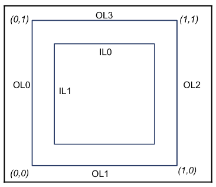
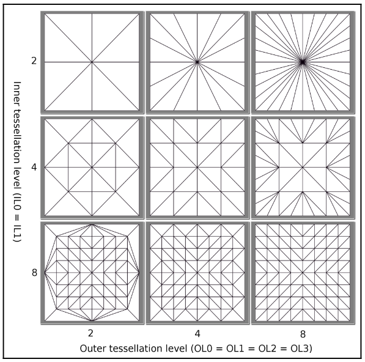
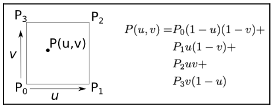

# Chapter47 细分 2D 四边形

[返回](../../README.md)

理解 OpenGL 硬件曲面细分的最佳方式之一是可视化二维四边形的曲面细分过程。
当使用线性插值时，生成的三角形与曲面细分图元生成器产生的曲面细分坐标 (u, v) 直接相关。
绘制几个具有不同内部和外部曲面细分级别的四边形，并研究生成的三角形，会非常有帮助。

## 47.1 参数

在使用四边形曲面细分时，曲面细分图元生成器会基于六个参数，将 (u, v) 参数空间细分为若干份。
这六个参数包括: u 方向和 v 方向的内部曲面细分级别(内部级别 0 和内部级别 1)，
以及沿 u 方向和 v 方向两条边缘的外部曲面细分级别(外部级别 0 至 3)。
这些参数决定了参数空间边缘及内部的细分份数:

- 外部级别 0(OL0): 指在 u = 0 处，沿 v 方向的细分份数。
- 外部级别 1(OL1): 指在 v = 0 处，沿 u 方向的细分份数。
- 外部级别 2(OL2): 指在 u = 1 处，沿 v 方向的细分份数。
- 外部级别 3(OL3): 指在 v = 1 处，沿 u 方向的细分份数。
- 内部级别 0(IL0): 指针对 v 的所有内部值，沿 u 方向的细分份数。
- 内部级别 1(IL1): 指针对 u 的所有内部值，沿 v 方向的细分份数。

下图展示了曲面细分级别与参数空间中各个参数所影响区域之间的关系: 
外部级别决定了边缘的细分份数，内部级别则决定了内部的细分份数。

## 47.2 线性插值

如果绘制一个由单个四边形(四个顶点)组成的面片图元，并采用线性插值，
那么生成的三角形将有助于理解 OpenGL 是如何实现四边形曲面细分的。
下图展示了不同曲面细分级别下的效果:

当使用线性插值时，生成的三角形直观呈现了 (u, v) 参数空间。
x 轴对应 u 坐标，y 轴对应 v 坐标。
这些三角形的顶点就是曲面细分图元生成器产生的 (u, v) 坐标。
细分份数可在三角形网格中清晰看出。
例如，当外部级别设为 2、内部级别设为 8 时，可看到四边形的外部边缘被细分为 2 份，
而内部的 u 方向和 v 方向则各被细分为 8 个区间。

如果四边形的四个角如下图所示，那么四边形内的任意一点，均可通过基于 u、v 参数对这四个角进行线性插值来确定。
曲面细分图元生成器创建一组带有合适参数坐标的顶点，并通过下面的方程对四边形的四个角进行插值，从而确定对应的位置。

## 47.3 细分 2D 四边形展示

[返回](../../README.md)