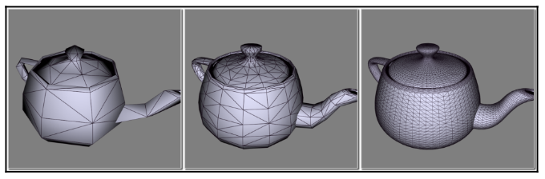

# Chapter48 细分 3D 曲面

[返回](../../README.md)

作为 3D 曲面细分的示例，再次渲染 “茶壶多面体(teapotahedron)”。
茶壶的数据集实际上定义为一组 4×4 的控制点面片，非常适合用于三次贝塞尔插值(cubic Bezier interpolation)。
因此，渲染茶壶的核心本质上就是渲染一组三次贝塞尔曲面(cubic Bezier surfaces)。
显然，这正是细分着色器(tessellation shaders)的绝佳用武之地！
将每个包含 16 个顶点的面片作为面片图元(patch primitive)进行渲染，
使用四边形曲面细分(quad tessellation)对参数空间进行细分，
并在细分评估着色器(tessellation evaluation shader)中实现贝塞尔插值。

## 48.1 插值

下图展示了预期的输出效果示例: 
左侧的茶壶采用内部和外部曲面细分级别 2 渲染，
中间的采用级别 4，
右侧的茶壶则采用细分级别 16。
细分评估着色器会完成贝塞尔曲面插值的计算。

首先，来看三次贝塞尔曲面插值的工作原理。若曲面由一组 16 个控制点(按 4×4 网格排列)Pij定义（其中 i 和 j 的取值范围为 0 到 3），则参数化贝塞尔曲面由以下公式给出：

$$
P(u,v)=\sum_{i=0}^{3}\sum_{j=0}^{3} B_i^{3}(u)\,B_j^{3}(v)\,P_{ij}
$$

还需要计算每个插值位置的法向量(normal vector)。
为此，必须计算上述公式偏导数(partial derivatives)的叉乘(cross product):

$$
\mathbf{n}(u,v)=\frac{\partial P}{\partial u}\times\frac{\partial P}{\partial v}
$$

贝塞尔曲面的偏导数最终可简化为伯恩斯坦多项式的偏导数:

$$
\frac{\partial P}{\partial u}
=
\sum_{i=0}^{3}\sum_{j=0}^{3}
\frac{\partial B_i^{3}(u)}{\partial u}\, B_j^{3}(v)\, P_{ij}
$$

$$
\frac{\partial P}{\partial v}
=
\sum_{i=0}^{3}\sum_{j=0}^{3}
B_i^{3}(u)\, \frac{\partial B_j^{3}(v)}{\partial v}\, P_{ij}
$$

## 48.2 细分 3D 曲面展示

[返回](../../README.md)